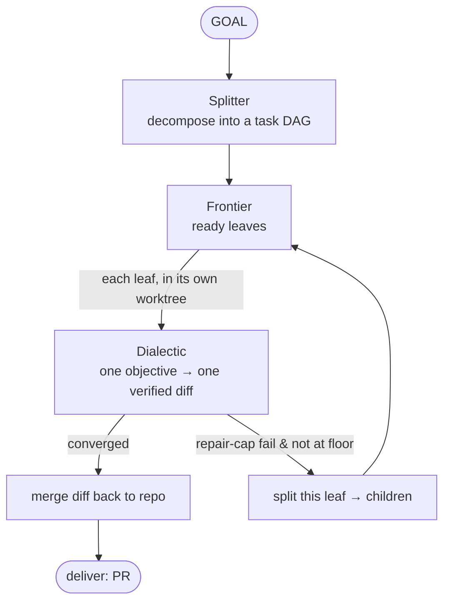
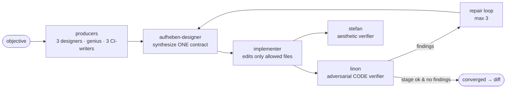
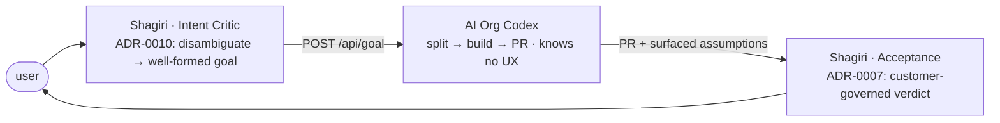

# AI Org Codex — architecture

The Codex edition (`ai-org-bootstrap-codex`) is a **complete autonomous builder**: a natural-language
**GOAL** goes in, **pull requests** come out. It is three deterministic harnesses stacked around three
semantic (LLM) cores — each layer is *code that must be right every time* wrapping *a judgment that needs
a model*.

| Layer | Entry | Unit in → out | Core |
| --- | --- | --- | --- |
| **carrier** | `scripts/carrier_harness.py` | a prompt → one Codex run | one agent does one bounded job |
| **dialectic** | `scripts/controller_pipeline.py` | one **objective** → one verified diff | the 10-agent DAG, re-verified outside the carrier |
| **autonomous builder** | `scripts/controller_goal.py` | one **goal** → PRs | split → build → recurse → deliver |



---

## Layer 1 — carrier (`carrier_harness.py`)

The single subprocess boundary to one Codex agent. It owns the discipline an LLM controller would forget:

- `codex exec --json` with **stdin closed** (no stdin-wait hang), pinned flags, `bootstrap/carrier-discipline.md`
  prepended ("you are a carrier, not the controller — the contract's *do NOT* overrides your judgment").
- **Bounded** by a wall-clock timeout **and** a no-output heartbeat: silence past the heartbeat = `frozen`,
  kill + **retry** (default 1). This is the freeze the town renders as a comms-cloud.
- **Scope enforcement** after the run: a write role that touched a file outside its allowed set fails.
- `--output-schema` is **avoided** (strict OpenAI schemas reject optional properties); the controller
  validates the carrier's JSON output itself in Python.

## Layer 2 — dialectic (`controller_pipeline.py`)

One objective → one verified diff. The registry (`registry/runtime-registry.yaml`) owns the agent DAG;
the pipeline derives a deterministic order from it.



| Agent | Role |
| --- | --- |
| `aggressive-designer` | pressure-tests scope, sequencing, hidden assumptions |
| `conservative-designer` | preserves repo continuity, CI, dependencies, rollback |
| `genius` | evidence-gated outside insight after local intake |
| `aufheben-designer` | synthesizes the design tension into **one** implementation contract |
| `implementer` | edits only files the contract allows |
| `linon` | read-only adversarial **code** verifier (NN1–NN4 + RED tests) |
| `stefan` | read-only **aesthetic** verifier on rendered pixels (design counterpart to Linon) |
| `*-ci-action-writer` ×3 | wire functional / security / nonfunctional checks into Actions |

**Convergence** is exact: `converged = linon stage is ok AND linon has zero findings`. While Linon has
findings, the repair loop (≤ 3) re-runs the producers / aufheben / implementer. Designers are *advisory*
producers — a failed designer does not sink the run if aufheben still has a valid input.

### Execution invariants

- **org_root / workspace split** — `AI_ORG_ROOT` separates the org install (roles, registry, schemas,
  gate scripts) from the `--repo` workspace, so the org can build an **external** repo, not only itself.
- **per-stage worktree isolation** — every WRITE role runs in its own git worktree detached at HEAD, so
  its scope check sees ONLY its own diff (an implementer is never charged for a CI-writer's `.github`
  edits) and independent write roles run in parallel; changes merge back after the wave.
- **role.md injection** — `codex exec` does not load `.codex/agents/*.toml`, so each role contract
  (`roles/*.md`) is injected into its carrier prompt.
- **carrier-output robustness** — a carrier that exits 0 but writes unparseable JSON used to sink the
  stage. `_read_result` now **salvages** it (strip markdown fences, extract the first `{…}`/`[…]`, close
  missing brackets, fall back to `ast.literal_eval` for Python-literal output); if still unrecoverable,
  the stage **reasks** the carrier once for clean JSON.

## Layer 3 — autonomous builder (`controller_goal.py`)

One goal → PRs. `run_goal` is the recursive **Splitter-Queue** — the Splitter and the Queue are one node:
`run()` a leaf via the dialectic; `split()` it when it cannot converge.

- **`splitter.py`** turns a goal (or a stuck task) into a child task DAG via a read-only Codex carrier,
  grounded in the codebase rather than imagined.
- **`frontier.py`** is the recursive task model: `ready_tasks` returns the runnable **leaves** (disjoint
  leaves run in parallel, dependents serialize), a task may hold `children` (a sub-plan), and a node is
  done when all its children are.
- each leaf runs the dialectic in its **own worktree**; on convergence its diff merges back, on a
  repair-cap failure it **splits into children** (recursion) — UNLESS it is at the **FLOOR** (max depth),
  where it fails rather than splitting forever.
- termination is the floor + a token budget, **never a human**: when stuck the org re-decomposes or
  fails the branch; it never escalates to a person mid-build.

### The Splitter's two axes (the central design)

Granularity is decided on **two** axes — neither is "smallest unit":

1. **Parallelism** — split genuinely independent work (no shared scope, no dependency) so the Frontier
   runs it concurrently.
2. **Reviewability** — split only enough that **Linon can verify a task in one pass**. This is a function
   of the change's **IMPACT / blast radius** (everything it touches across the system), *not* its line
   count: a one-line edit to a shared contract is hard to verify; a large edit confined to a leaf module
   is easy.

Make each task **as large as possible** while satisfying both, and **start coarse** — the
split-on-convergence-failure recursion refines only the tasks that actually prove too big. Linon taking
time on a high-impact change is **by design**, not a bug; over-splitting an inherently-sequential feature
just pays the heavy review cost N× with no parallel gain. The Splitter's LLM judgment may misjudge, and
that is tolerated: too coarse → recursion self-corrects; too fine → slower but still correct. Both bounded.

## Observability — the shared stream

Everything appends JSON event lines to one shared append-only log (`.agent-runs/stream.jsonl`, pointed at
by `STREAM_LOG` so events land in the shared log even from an isolated worktree). It is a **log**, not a
message bus — consumers tail it and decide what to show.

```
goal_split          n tasks                          ── the decomposition
leaf_start          {id = task_id}                   ── a leaf began
leaf_run            {task_id, run_id}                ── BRIDGE: ties the task to its dialectic run
stage_done          {ts, source = role, run_id, ok,  ── every dialectic stage (who / what / when)
                     unresolved_failures}                + WHY it failed
leaf_done / leaf_split / leaf_failed_floor / goal_done
```

The `leaf_run` bridge is what lets a consumer (Shagiri's town) attribute each leaf's stage activity — its
agent **marmots** — to the task it belongs to, and reconstruct the live split state (which marmots in
which leaf, how many leaves run in parallel) from the log alone.

---

## The host boundary — AI Org builds, Shagiri hosts

The AI Org is a **pure builder**: it receives a *well-formed* goal and returns PRs. Everything about a
human — disambiguating intent, judging business-correctness — lives in the **host** (Shagiri).



- **Intent Critic** (ADR-0010, Shagiri, *build last*) — turns arbitrary user granularity **and**
  ambiguity into a well-formed goal: routes PROCEED-provisionally / ASK / PROBE / HOLD (hard gates —
  destructive / charge / PII / deploy / publish — always HOLD). The AI may choose the *means* but never
  silently choose the stakeholder's *utility function*.
- **Acceptance** (ADR-0007, Shagiri) — the Customer-Governed Acceptance Agent: the **oracle**
  (business-correct expected result) is an un-delegable human input.
- **M4 host interface** (Shagiri `cockpit/server.py`) — `POST /api/goal` starts a `controller_goal.py`
  subprocess (AI_ORG_ROOT = org install, STREAM_LOG = shared repo), delivers the accumulated diff as one
  PR through the ADR-0005 gate, and serves `GET /api/stream?since=N` for the town to tail.

The org **never calls the user**: a mid-build ambiguity becomes a tracked assumption surfaced on the PR,
not an interrupt — that would break autonomy.

---

## Principles

- **Never a human mid-build.** Termination is floor + budget; stuck-ness re-decomposes or fails, it does
  not page a person.
- **The oracle is un-delegable.** The machine builds the *means*; the *business-correct result* stays with
  the customer (ADR-0007).
- **Linon reads WIDE.** A reviewer's scope is the change's whole blast radius, the opposite of the
  implementer's narrow write-scope; diff-scoping Linon was rejected — it dulls the sharpness.
- **Trust nothing; verify by running.** Re-verify outside the carrier; a green stage is a claim until the
  gates and Linon confirm it.

## Source of truth

| File | Owns |
| --- | --- |
| `scripts/controller_goal.py` | the autonomous builder: `run_goal`, `default_run_leaf`, floor, budget, stream bridge |
| `scripts/frontier.py` | the recursive task model: `ready_tasks`, `advance`, `node_status`, `scope_conflict` |
| `scripts/splitter.py` | `split()` — the two-axis decomposition prompt |
| `scripts/controller_pipeline.py` | the dialectic DAG: waves, repair loop, convergence, JSON salvage + reask, stream tee |
| `scripts/carrier_harness.py` | the carrier launcher: stdin-closed, timeout + freeze + retry, scope enforcement |
| `registry/runtime-registry.yaml` | the agent graph (role → adapter, schema, write scope, output target) |
| `roles/*.md` | role contracts, injected into each carrier prompt |
| `scripts/merge-gate.py` | the sole merge path |

Design records live in the host (Shagiri `docs/adr/`): ADR-0005 delivery, 0006 Frontier, 0007 Acceptance,
0008 Splitter, 0009 the stream, 0010 the Intent Critic.
